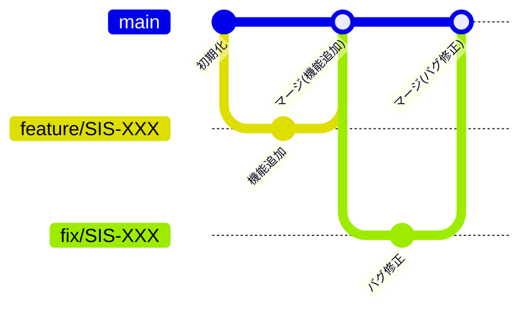

#  helpdesk-app-backend

##  プロジェクト / アプリ概要
このプロジェクトは、社内向けヘルプデスクアプリのバックエンドです。

社員が業務上の困りごとや質問をチャット形式で投稿すると、サポーターが回答を返す仕組みを提供します。

【社員】  
ログイン後、チャット画面からサポーターに質問を投げることができます。  
自分の質問に対する回答を確認できるだけでなく、他の社員の質問も履歴として残るため参照することが可能です。  
各質問には、ステータス（例：新規質問、対応中、解決済みなど） が設定され、対応状況を確認することができます。  

【サポーター】  
社員から寄せられた質問を確認し、適切な回答をチャットで返します。  
また、全ての質問・回答の履歴を確認でき、対応状況の把握や品質管理に役立てられます。  
各質問には、ステータス（例：新規質問、対応中、解決済みなど） が設定され、対応状況を確認することができます。  

【管理者】  
社員やサポーターのユーザー管理（追加・削除）を行うことができます。  
また、全ての質問・回答の履歴を確認でき、対応状況の把握や品質管理に役立てられます。  

すべてのユーザー（社員／サポーター／管理者）は、ログイン画面から認証を行い、  
それぞれの専用ページにアクセスして機能を利用します。

---

##  使用技術
- 言語: Python
- フレームワーク: FastAPI
- ビルドツール: Vite
- UIライブラリ: Chakra UI
- パッケージ管理: Poetry
- DB: MySQL
- ORM：SQLAlchemy

---

##  ディレクトリ構成（src/以下）
- api/：エンドポイント定義、リクエスト/レスポンスの処理
- core/：アプリ全体の設定・初期化
- exceptions/：カスタム例外クラスの定義
- handlers/：エラー発生時の処理・例外ハンドリング
- loggers/：ログ出力の設定・管理
- logic/：ビジネスロジック（DB操作は含まない）
- models/
  - db/：テーブル定義
  - response/：APIレスポンス用のモデル定義
  - request/：APIリクエスト用のモデル定義
- repositories/：DBへのCRUD操作、クエリ実行

---

##  環境構築手順
1. リポジトリをクローン
```bash
  git clone git@github.com:novel-sarugaku/helpdesk-app-frontend.git
  cd helpdesk-app-backend
```
> 上記は SSH を使用した場合の例 です。  
> HTTPS を使用する場合は GitHub 上でリポジトリのクローン用 URL を変更してください。
2. イメージビルド（初回起動時・設定変更時）
> 事前準備：.env.exampleをコピーして.envファイルを作成し、プロジェクト直下に配置
```bash
docker compose build
```
3. コンテナ起動
```bash
docker compose up -d
```

---

##  ポート設定
- 開発環境のポート
  - アプリケーション: 8000 (標準)
  - MySQL: 3306 (標準)

- 設定ファイル
  - 開発環境: docker-compose.yml

---

##  ブランチ運用について

###  概要
本プロジェクトでは、開発効率の向上とコード品質の維持を目的に、GitHub上でのブランチ運用ルールを定める。ブランチ戦略を明文化し、コードレビューやリリース手順を標準化することで、品質を保ちながら作業の重複やコンフリクトを最小化する。チーム全員が合意したルールに従うことで、スムーズなコラボレーションと安定したリリースサイクルを実現する。

----

###  ブランチ構成

####  main
- 目的： 本番環境の状態を管理
- 特徴： 常に安定した状態を保つ
- 使用タイミング： リリース確定時

####  feature/*
- 目的： 新機能開発用ブランチ
- 特徴： 1タスク1ブランチ
- 分岐元 / マージ先： mainブランチ
- 使用タイミング： 機能実装時

####  fix/*
- 目的： バグ修正用ブランチ
- 特徴： 原因箇所への最小修正を原則とする
- 分岐元 / マージ先： mainブランチ
- 使用タイミング： PRのマージ後にバグがあった場合

----

###  ブランチ命名規則

####  feature/* の場合
```bash
書き方：feature/タスク番号
例：feature/SIS-1
```
####  fix/* の場合
```bash
書き方：fix/タスク番号
例：fix/SIS-1
```
>※タスク番号：IRAのストーリー/バグキーのこと

----

###  使用時のルール

####  運用フロー図



----

####  開発フロー
**1. main ブランチからタスク毎に featureまたはfix ブランチを作成**
- 各担当者が開発・修正作業
- 作業後、リモートリポジトリへPush

**2. Pull Request（以降PRとする）を作成**
- 書き方
  - タイトル
    - 必ずタイトル頭に[タスク番号]を記載
    - 例： [SIS-1] xxxxxxxx
    >※タスク番号：JIRAのストーリー/バグキーのこと
  - 内容
    - 以下の内容を記述
      - 概要
      - 変更点
      - 影響範囲
      - テスト
      - 該当タスク
- レビュアー設定
  - 事前に Collaborators で追加したメンバーの中から指定
- 統合先の確認
  - 統合先が main ブランチになっているかを確認
- 原則
  - CIによるチェックをクリアすること
  - 他者レビューを必ず経由すること

**3. コードレビュー**
- 管理者がソースレビューを実施
- 承認後にマージ

----

###  タスクに対するブランチの使用方法
- JIRAで自分が担当のタスクを確認
  >※タスク：JIRAのストーリーのこと
- main ブランチから、各タスクに対して1ブランチを作成
- 作業完了後、PRを提出
- PR承認後、main ブランチにマージ

----

###  禁止事項
- main ブランチに直接 push しない
- 未レビューのコードを merge しない
- 命名規則に従わないブランチ作成

----

###  例外
今回のプロジェクトでは、 developやrelease ブランチは使用せず、feature/* や fix/* などの作業ブランチから main ブランチへ直接マージする方針とする。

---

## 開発用仮想環境の作成/入退室方法

1. Homebrewをインストール（未インストールの場合）  
Homebrewの公式からインストールを行う。

2. poetry をインストール（未インストールの場合）
```bash
brew install poetry
```

3. プロジェクト直下へ移動して依存インストール
```bash
cd [クローンしたディレクトリ]
poetry install
```

4. 仮想環境に入る
```bash
poetry env activate
```
出力されたコマンドをコピーし実行（出力されるもの例：source XXX/XXX/.venv/bin/activate）

5. 仮想環境から出る
```bash
deactivate
```

---

## Linter / Formatter - Ruff

このプロジェクトでは Python のコード整形および静的解析ツールとして Ruff を使用します。Ruff は Linter Formatter の両方を一括で提供します。なお、開発用仮想環境でのみ使用する方針です。

---

###  使用目的

####  Ruff
- 構文エラーやバグの早期検出
- 未使用変数・未使用インポートの検出
- 型ヒントまわりの一般的な落とし穴の指摘
- プロジェクト全体のスタイル/規約の統一
- 自動コード整形（インデント/クォート/改行など）

###  CLI での実行方法
```bash
# コードチェック
ruff check .

# 自動修正を含むチェック
ruff check . --fix

# フォーマットチェック
ruff format --check .

# 自動整形
ruff format .
```
